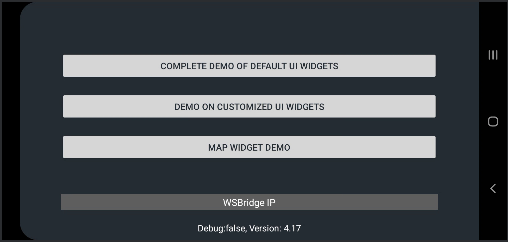
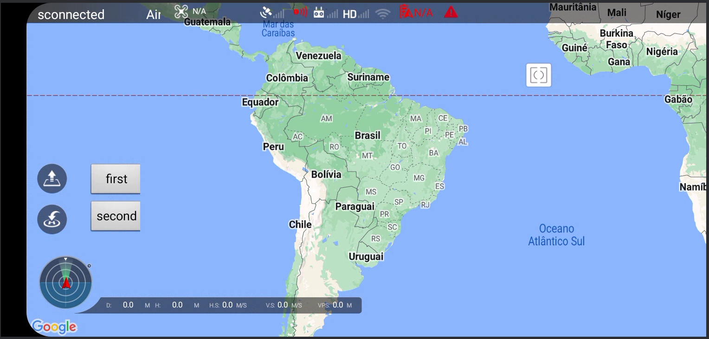
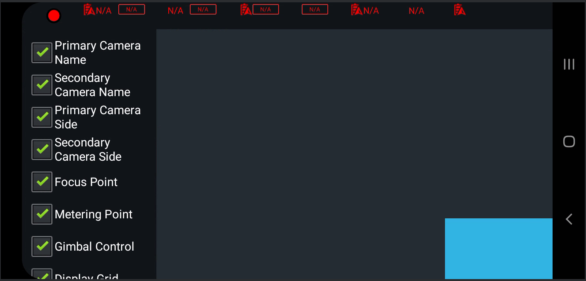
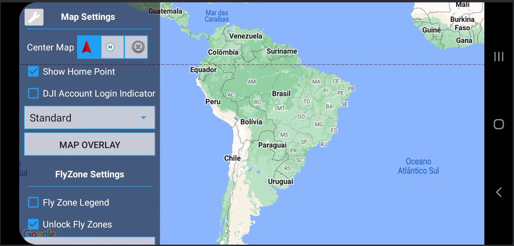

# Derivação do projeto DJI UX SDK for Android Latest Version 4.16.2

#### O projeto conta com três versões utilizando o conjunto do UX SDK da DJI para acelerar o desenvolvimento de aplicativos

#### Versão padrão do UX SDK da DJI com o adicional de um mapa alternando entre o feedback da câmera e o mapa

#### Versão personalizada com adições de outras funcionalidades dependendo das necessidades do aplicativo

#### Versão para diferentes tipos de provedor de mapa como: Here Maps, Google Maps, AMaps e Mapbox

## What is This?

The UX SDK is a suite of product agnostic UI objects that fast tracks the development of Android applications using the [DJI Mobile SDK](http://developer.dji.com/mobile-sdk/).
Also, check out the new open source version of [UX SDK Beta ](https://github.com/dji-sdk/Mobile-UXSDK-Beta-Android).

## Integration

Declare dependency via Maven:

~~~xml
<dependency>
    <groupId>com.dji</groupId>
    <artifactId>dji-uxsdk</artifactId>
    <version>4.16.2</version>
</dependency>

<dependency>
    <groupId>com.dji</groupId>
    <artifactId>dji-sdk-provided</artifactId>
    <version>4.16.2</version>
</dependency>
~~~

or Gradle:

~~~groovy
implementation ('com.dji:dji-uxsdk:4.16.2', {
    /**
     * Comment the "library-anti-distortion" if your app does need Anti Distortion for Mavic 2 Pro and Mavic 2 Zoom.
     * Comment the "fly-safe-database" if you do not need database for release, or we will download it when DJISDKManager.getInstance().registerApp
     * is called.
     * Both will greatly reduce the size of the APK.
     */
    exclude module: 'library-anti-distortion'
    // exclude module: 'fly-safe-database'

    /**
     * Uncomment the following line to exclude amap from the app.
     * Note that Google Play Store does not allow APKs that include this library.
     */
    // exclude group: 'com.amap.api'
})
compileOnly ('com.dji:dji-sdk-provided:4.16.2')
~~~

For further detail on how to integrate the DJI UX SDK into your Android Studio project, please check the [Getting Started with UX SDK](http://developer.dji.com/mobile-sdk/documentation/android-tutorials/UXSDKDemo.html#import-maven-dependency) tutorial.

## Get Started With DJI UX SDK

Please check this [Getting Started with DJI UX SDK](http://developer.dji.com/mobile-sdk/documentation/android-tutorials/UXSDKDemo.html) tutorial to learn how to use DJI Android UX SDK and DJI Android SDK to create a fully functioning mini-DJI Go app easily, with standard DJI Go UIs and functionalities.

## Learn More about DJI UX SDK

Please visit [UX SDK Introduction](http://developer.dji.com/mobile-sdk/documentation/introduction/ux_sdk_introduction.html) for more details.

## Development Workflow

From registering as a developer, to deploying an application, the following will take you through the full Mobile SDK Application development process:

- [Prerequisites](https://developer.dji.com/mobile-sdk/documentation/application-development-workflow/workflow-prerequisits.html)
- [Register as DJI Developer & Download SDK](https://developer.dji.com/mobile-sdk/documentation/application-development-workflow/workflow-register.html)
- [Integrate SDK into Application](https://developer.dji.com/mobile-sdk/documentation/application-development-workflow/workflow-integrate.html)
- [Run Application](https://developer.dji.com/mobile-sdk/documentation/application-development-workflow/workflow-run.html)
- [Testing, Profiling & Debugging](https://developer.dji.com/mobile-sdk/documentation/application-development-workflow/workflow-testing.html)
- [Deploy](https://developer.dji.com/mobile-sdk/documentation/application-development-workflow/workflow-deploy.html)

## Feedback

We’d love to have your feedback as soon as possible. Reach out to us when you hit roadblocks, or want to talk through something. At a minimum please let us know:

- What improvements would you like to see?
- What is hard to use or inconsistent with your expectations?
- What is good?
- Any bugs you come across.

## Support

You can get support from DJI with the following methods:

- Post questions in [**Stackoverflow**](http://stackoverflow.com) using [**dji-sdk**](http://stackoverflow.com/questions/tagged/dji-sdk) tag
- dev@dji.com

## Join Us

DJI is looking for all kinds of Software Engineers to continue building the Future of Possible. Available positions in Shenzhen, China and around the world. If you are interested, please send your resume to <software-sz@dji.com>. For more details, and list of all our global offices, please check <https://we.dji.com/jobs_en.html>.

DJI 招软件工程师啦，based在深圳，如果你想和我们一起把DJI产品做得更好，请发送简历到 <software-sz@dji.com>.  详情请浏览 <https://we.dji.com/zh-CN/recruitment>.
